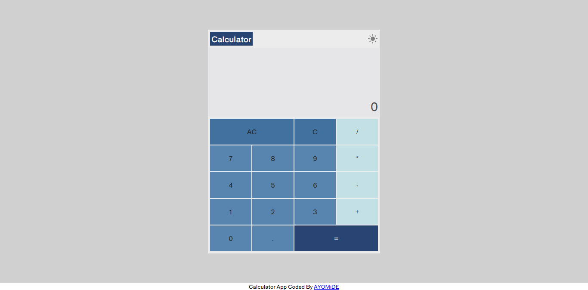
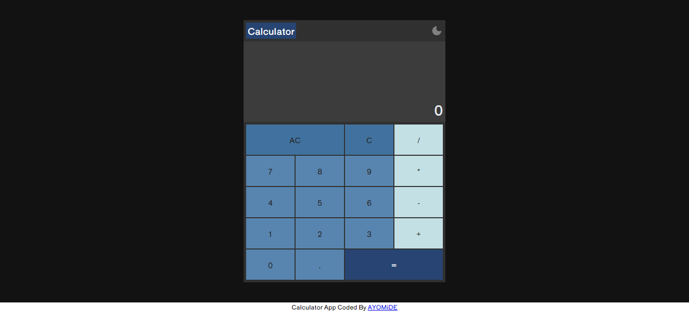

# Calculator App

This is a simple calculator app performs basic operations or functions such as addition, subtraction, multiplication and division. It can be used to solve basic arithmetic problems.

Users should be able to:

- View the optimal layout depending on their device's screen size
- Perform the following operations:
  - Addition
  - Subtraction
  - Multiplication
  - Division
- Change calculator app theme

### Screenshot
- Light Mode

- Dark Mode
